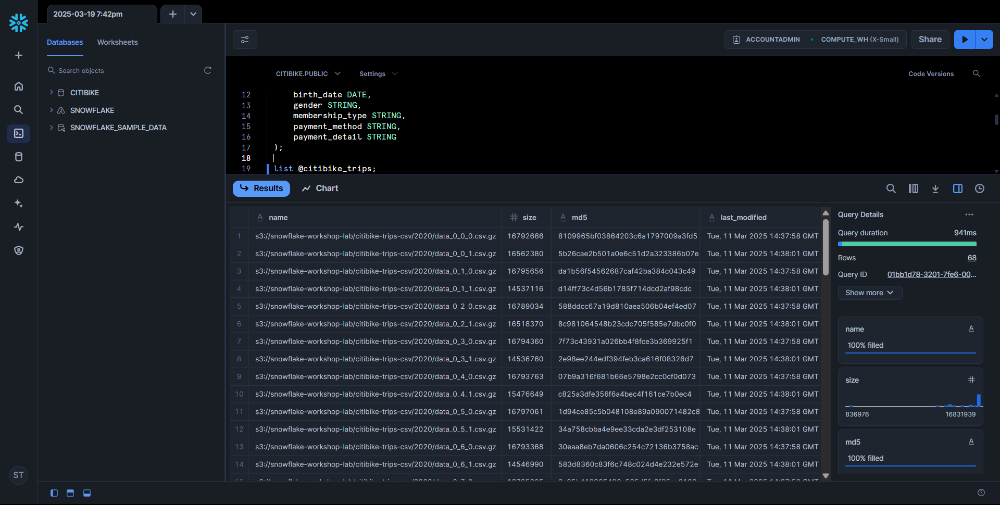
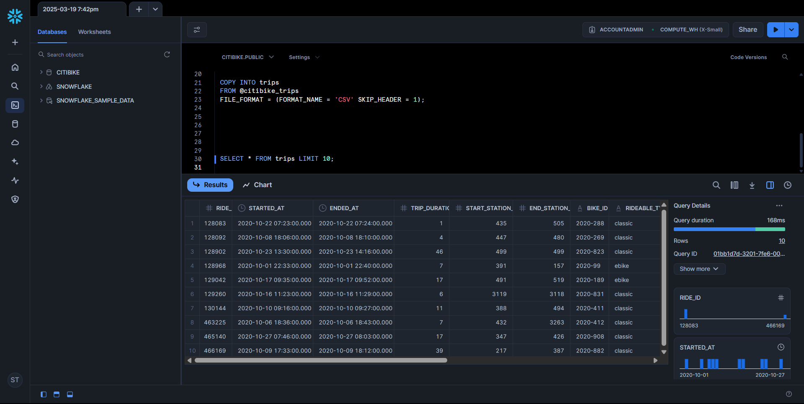

# Citi Bike and Weather Data Analysis in Snowflake

## Author

- **Name**: Swastik Tripathi  
- **Email**: swastiktripathi10@gmail.com

---

## Introduction

This project demonstrates a comprehensive data engineering and analysis workflow using Snowflake, focusing on the **Citi Bike trip dataset**. The dataset, sourced from the `@citibike_trips` stage in Snowflake and originally obtained from [Citi Bike System Data](https://citibikenyc.com/system-data), contains detailed records of bike trips in New York City, spanning January 1, 2020, to March 27, 2024, with 23,365,258 rows. The objective was to load, transform, and analyze this data, integrate it with historical weather data for New York City, and visualize key insights. SQL queries were developed and executed within a Snowflake worksheet, accessible at [Snowflake Worksheet](https://app.snowflake.com/ftsfpjt/wo54189/w2qZlNfBGn5g#query), and the results were extended into interactive dashboards using Looker Studio, available at [Looker Studio Report](https://lookerstudio.google.com/reporting/268f2638-9cf1-4b37-a45f-cfdae26139ba).

The operations showcased include creating and loading tables, querying for analytical insights, handling semi-structured JSON data, cloning tables, leveraging Snowflake’s Time Travel feature, and building visualizations. This documentation highlights proficiency in SQL, data management, and modern data tools, making it a strong example of technical expertise for a data engineering or analytics role.

---


Final Dashboard


## Setting Up the Environment

### Tools and Environment

All SQL queries and data operations were executed within a **Snowflake worksheet**, providing an interactive environment to manage and analyze the Citi Bike trip data. The worksheet is accessible at [Snowflake Worksheet](https://app.snowflake.com/ftsfpjt/wo54189/w2qZlNfBGn5g#query). Snowflake’s cloud-based data platform enabled efficient handling of large datasets, semi-structured data processing, and advanced features like Time Travel. The `ACCOUNTADMIN` role and `COMPUTE_WH` warehouse were used where necessary to ensure sufficient privileges and computational resources.

---

## 1. Creating the `trips` Table

The first step was to establish a structured schema for the Citi Bike trip data by creating the `trips` table.

```sql
CREATE OR REPLACE TABLE trips (
    ride_id INTEGER,
    started_at TIMESTAMP,
    ended_at TIMESTAMP,
    trip_duration INTEGER,
    start_station_id INTEGER,
    end_station_id INTEGER,
    bike_id STRING,
    rideable_type STRING,
    user_id INTEGER,
    user_name STRING,
    birth_date DATE,
    gender STRING,
    membership_type STRING,
    payment_method STRING,
    payment_detail STRING
);
```

- **Purpose**: Defines a table to store trip details, including identifiers, timestamps, durations, station IDs, bike types, and user demographics.
- **Explanation**: The `CREATE OR REPLACE` syntax ensures idempotency, overwriting any existing table to start with a clean schema. Data types were chosen to match the dataset’s structure (e.g., `INTEGER` for IDs, `TIMESTAMP` for dates).

**Figure S1**: Screenshot of the successful creation of the `trips` table in Snowflake.  


**Figure S2**: Additional view of the table creation process or schema details.  


---

## 2. Loading Data

### 2.1 Creating the Stage
**Figure S3**: Creating the stage @citibike_trips  


Before loading, we confirmed the availability of the Citi Bike dataset in the `@citibike_trips` stage.

```sql
LIST @citibike_trips;
```

- **Purpose**: Lists files in the named stage to ensure data is staged and ready for ingestion.
- **Explanation**: The `@citibike_trips` stage contains CSV files of historical trip records sourced from [Citi Bike System Data](https://citibikenyc.com/system-data), forming the basis of this analysis.

**Figure S4**: Screenshot showing the files listed in the `@citibike_trips` stage.  



### 2.2 Defining a CSV File Format

A file format was created to parse the CSV data correctly.

```sql
CREATE FILE FORMAT CSV
    TYPE = CSV
    COMPRESSION = AUTO
    FIELD_DELIMITER = ','
    RECORD_DELIMITER = '\n'
    SKIP_HEADER = 0
    FIELD_OPTIONALLY_ENCLOSED_BY = '"'
    TRIM_SPACE = FALSE
    ERROR_ON_COLUMN_COUNT_MISMATCH = FALSE
    ESCAPE = NONE
    ESCAPE_UNENCLOSED_FIELD = '\\'
    DATE_FORMAT = AUTO
    TIMESTAMP_FORMAT = AUTO;
```

- **Purpose**: Specifies how Snowflake interprets CSV files during loading.
- **Explanation**: This configuration handles comma-separated fields, newline-separated records, and quoted values, with `ERROR_ON_COLUMN_COUNT_MISMATCH = FALSE` to accommodate potential data inconsistencies.

**Figure S5**: Screenshot confirming the creation of the `CSV` file format.  


### 2.3 Loading the Dataset into the `trips` Table

The Citi Bike trip data was loaded from the `@citibike_trips` stage into the `trips` table.

```sql
COPY INTO trips 
FROM @citibike_trips 
FILE_FORMAT = (FORMAT_NAME = 'CSV' SKIP_HEADER = 1);
```

- **Purpose**: Transfers the dataset from the stage to the table, skipping the header row for proper column alignment.
- **Explanation**: The `COPY INTO` command efficiently ingests the CSV data, mapping it to the table’s 15 columns. The `SKIP_HEADER = 1` option ensures the first row (column names) is ignored.

**Figure S6**: Screenshot showing the result of the data load, including rows processed.  


---

## 3. Querying and Analyzing Data

### 3.1 Inspecting Loaded Data

A sample of the loaded data was queried to verify its integrity.

```sql
SELECT * FROM trips LIMIT 10;
```

- **Purpose**: Displays the first 10 rows to confirm successful loading and data consistency.
- **Explanation**: This step ensures fields like `started_at`, `trip_duration`, and `membership_type` are correctly populated.

**Figure S7**: Screenshot of the first 10 rows from the `trips` table.  



### 3.2 Analyzing Hourly Trip Patterns

Trip frequency and duration were aggregated by hour.

```sql
SELECT 
    DATE_TRUNC('hour', started_at) AS "date",
    COUNT(*) AS "num_trips",
    AVG(trip_duration) / 60 AS "avg_duration_mins"
FROM trips
GROUP BY 1
ORDER BY 1;
```

- **Purpose**: Identifies peak usage times and average trip lengths by hour.
- **Explanation**: `DATE_TRUNC('hour', started_at)` groups trips into hourly buckets, while `COUNT(*)` and `AVG(trip_duration) / 60` calculate trip counts and durations in minutes.

**Figure S8**: Screenshot showing hourly trip counts and average durations.  


### 3.3 Identifying the Busiest Month

The busiest months were determined by trip volume.

```sql
SELECT 
    MONTHNAME(started_at) AS "month",
    COUNT(*) AS "num_trips"
FROM trips
GROUP BY 1
ORDER BY 2 DESC;
```

- **Purpose**: Reveals seasonal trends by ranking months by trip count.
- **Explanation**: `MONTHNAME` extracts the month name, and ordering by `num_trips` descending highlights peak usage periods.

**Figure S9**: Screenshot displaying the months with the highest trip counts.  


---

## 4. Cloning Tables for Development

A development copy of the `trips` table was created.

```sql
CREATE TABLE trips_dev CLONE trips;
```

- **Purpose**: Produces an identical copy for testing or development without affecting the original data.
- **Explanation**: Snowflake’s zero-copy cloning shares the underlying data efficiently until modifications occur.

**Figure S10**: Screenshot confirming the creation of the `trips_dev` table.  


---

## 5. Working with Weather Data

### 5.1 Setting Up the Weather Database

A new database was created for weather data.

```sql
CREATE DATABASE WEATHER;
USE ROLE ACCOUNTADMIN;
USE WAREHOUSE COMPUTE_WH;
USE DATABASE WEATHER;
USE SCHEMA PUBLIC;
```

- **Purpose**: Establishes a separate environment for weather data integration.
- **Explanation**: The `ACCOUNTADMIN` role ensures full privileges, and `COMPUTE_WH` provides the necessary compute resources.

### 5.2 Creating a Table for JSON Weather Data

A table was defined to store raw JSON weather data.

```sql
CREATE TABLE json_weather_data (v VARIANT);
```

- **Purpose**: Stores semi-structured weather data in a flexible format.
- **Explanation**: The `VARIANT` type accommodates JSON’s nested structure for later parsing.

**Figure S11**: Screenshot showing the creation of the `json_weather_data` table.  


### 5.3 Staging and Loading Weather Data

Weather data was staged and loaded from an external S3 bucket.

```sql
CREATE STAGE nyc_weather
URL = 's3://snowflake-workshop-lab/weather-nyc';

LIST @nyc_weather;

COPY INTO json_weather_data 
FROM @nyc_weather
FILE_FORMAT = (TYPE = JSON);
```

- **Purpose**: Connects to an S3 bucket containing NYC weather data, verifies its contents, and loads it into the table.
- **Explanation**: The stage links to an external source, and the `COPY INTO` command processes JSON files directly into the `VARIANT` column.

**Figure S12**: Screenshot confirming the loading of weather data.  


### 5.4 Inspecting JSON Weather Data

The raw JSON data was queried to verify its contents.

```sql
SELECT * FROM json_weather_data LIMIT 10;
```

- **Purpose**: Displays a sample of the loaded JSON data.
- **Explanation**: Ensures the semi-structured data is intact and ready for transformation.

**Figure S13**: Screenshot showing the first 10 rows of JSON data.  


### 5.5 Creating a Structured Weather View

A view was created to transform the JSON data into a structured format.

```sql
CREATE VIEW json_weather_data_view AS
SELECT
    v:time::TIMESTAMP AS observation_time,
    v:city.id::INT AS city_id,
    v:city.name::STRING AS city_name,
    v:city.country::STRING AS country,
    v:city.coord.lat::FLOAT AS city_lat,
    v:city.coord.lon::FLOAT AS city_lon,
    v:clouds.all::INT AS clouds,
    (v:main.temp::FLOAT) - 272.15 AS temp_avg,
    (v:main.temp_min::FLOAT) - 273.15 AS temp_min,
    (v:main.temp_max::FLOAT) - 273.15 AS temp_max,
    v:weather[0].main::STRING AS weather,
    v:weather[0].description::STRING AS weather_description,
    v:weather[0].icon::STRING AS weather_icon,
    v:wind.deg::FLOAT AS wind_dir,
    v:wind.speed::FLOAT AS wind_speed
FROM json_weather_data
WHERE city_id = 5128638;
```

- **Purpose**: Structures JSON fields into columns, filtering for New York City (`city_id = 5128638`).
- **Explanation**: Uses Snowflake’s JSON parsing syntax (e.g., `v:time`) to extract and cast fields, converting temperatures from Kelvin to Celsius.

**Figure S14**: Screenshot confirming the creation of the `json_weather_data_view`.  


### 5.6 Querying Weather Data for a Specific Month

Weather data for January 2018 was retrieved.

```sql
SELECT * FROM json_weather_data_view
WHERE DATE_TRUNC('month', observation_time) = '2018-01-01'
LIMIT 20;
```

- **Purpose**: Filters weather observations for a specific month.
- **Explanation**: `DATE_TRUNC` groups by month, and the limit ensures a manageable sample.

**Figure S15**: Screenshot showing weather data for January 2018.  


**Figure S16**: Additional screenshot related to weather data.  


---

## 6. Using Snowflake’s Time Travel

The `trips` table was reverted to a previous state using Time Travel.

```sql
-- Set query_id to the most recent modification of trips in the last 24 hours
SET query_id = (
    SELECT query_id 
    FROM TABLE(information_schema.query_history(end_time_range_start => DATEADD('hour', -24, CURRENT_TIMESTAMP())))
    WHERE query_text LIKE '%trips%'
      AND query_type IN ('INSERT', 'UPDATE', 'DELETE', 'COPY')
    ORDER BY start_time DESC
    LIMIT 1
);

-- Verify the query_id
SELECT $query_id AS selected_query_id;

-- Recreate trips to its state before the modification
CREATE OR REPLACE TABLE citibike.public.trips AS (
    SELECT * 
    FROM citibike.public.trips 
    BEFORE (STATEMENT => $query_id)
);
```

- **Purpose**: Restores the `trips` table to its state before the latest modification (e.g., the `COPY INTO` load).
- **Explanation**: The `SET` statement identifies the most recent modifying query, and `BEFORE` reverts the table to that prior state.

**Figure S17**: Screenshot showing the selected `query_id`.  

 

---

## 7. Data Visualization in Looker Studio

To extend the analysis, the `trips` table was connected to Looker Studio for interactive visualizations.

**Figure S18**: Screenshot confirming the connection of the `trips` table and showing configurations when connecting Snowflake to Looker Studio.  


- **Setup**: The `citibike.public.trips` table was linked as a data source in Looker Studio, enabling dashboard creation. The connection process is depicted in **Figure S18**.
- **Visualizations**: The dashboard includes:
  - **Month on Month Rides Count**: A time series showing monthly trip trends using `started_at`.
  - **Membership Type Breakdown**: A pie chart of `membership_type`.
  - **Payment Method Breakdown**: A bar chart of `payment_method`.
  - **Top Start Stations**: A bar chart of `start_station_id`.
  - **Trip Duration Distribution**: A bar chart with binned `trip_duration`.
  - **Gender and Age Analysis**: A stacked bar chart using `gender` and a calculated `Age Group` field.
- **Looker Studio File**: The interactive dashboard is available at [Looker Studio Report](https://lookerstudio.google.com/reporting/268f2638-9cf1-4b37-a45f-cfdae26139ba).

- **Purpose**: Provides a visual representation of trip patterns and user demographics.
- **Explanation**: Looker Studio enhances SQL analysis with interactivity, though weather integration awaits 2020-2024 data due to the current mismatch (weather data: 2016-2019).

**Figure S19**: Screenshot of the dashboard created in Looker Studio.  


**Figure S20**: Screenshot of the final dashboard in Looker Studio.  


---

## Conclusion

This project demonstrates a robust data engineering workflow in Snowflake, from loading and analyzing the Citi Bike trip dataset (23,365,258 rows, 2020-2024) sourced from [Citi Bike System Data](https://citibikenyc.com/system-data) to integrating weather data and preparing visualizations in Looker Studio. Key skills include:

- **SQL**: Table creation, data loading, aggregation, and JSON parsing.
- **Snowflake Features**: Stages, file formats, cloning, Time Travel.
- **Data Visualization**: Looker Studio integration for interactive insights, accessible at [Looker Studio Report](https://lookerstudio.google.com/reporting/268f2638-9cf1-4b37-a45f-cfdae26139ba).

While the weather data (2016-2019) currently doesn’t overlap with trip data (2020-2024), the framework is in place to analyze weather impacts once aligned data is sourced. This work, executed via a [Snowflake Worksheet](https://app.snowflake.com/ftsfpjt/wo54189/w2qZlNfBGn5g#query), reflects technical proficiency and problem-solving skills, ideal for a data engineering or analytics role.

---
